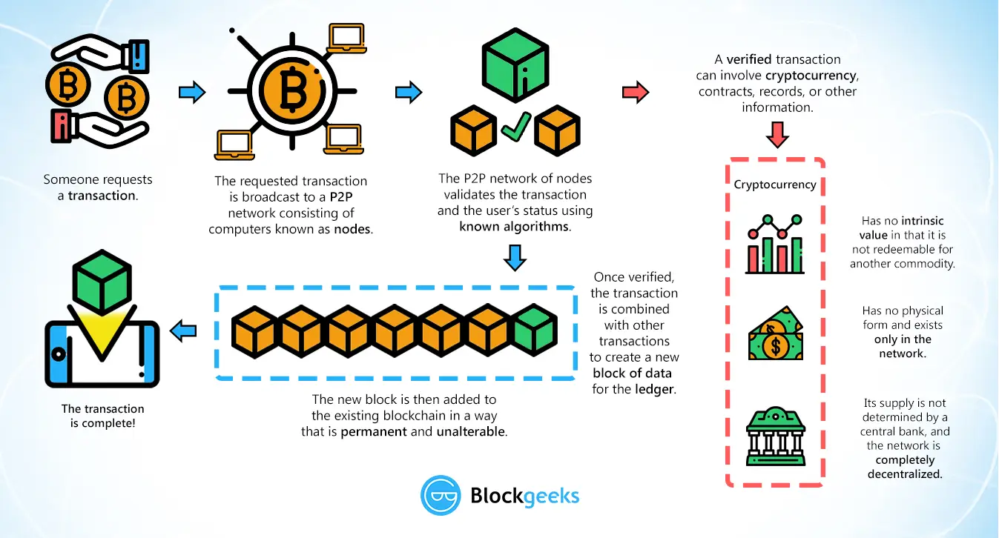

Blockchain is a digital, immutable, distributed ledger that chronologically records transactions in near real time. The prerequisite for each subsequent transaction to be added to the ledger is the respective consensus of the network participants (called nodes), thereby creating a continuous mechanism of control regarding manipulation, errors, and data quality - _Deloitte_

* Do not remove this line (it will not be displayed)
{:toc}

## Why Blockchain?
- We are now interconnected, global, ecosystem with huge data, cheap storage and enormous computing power, also
- there is erosion of trust (in pharma, in money value,), desire for freedom and privacy, no middleman, 
- low faith in government and distrust in organizations, 
- we need decentralized, open, trustable, secure, chain of data to hold all our information in transactional format. Hence, blockchain.

## What is Blockchain:
- it is data structure that holds transactional records with ensuring security, transparency and decentralization.
- it is immutable, 
- it is secure with data hashed and crytographically sealed, some have added level of security with multiple abstraction.
- it is distributed ledger that is verifiable.
- each block has 
  - hash, cryptography - it is one way hash function, it can't be decrypted. 
  - data and timestamp, 
  - hash of previous block, together they make chain.
- A Blockchain is a digital, immutable, distributed ledger that chronologically records transactions in near real time. The prerequisite for each subsequent transaction to be added to the ledger is the respective consensus of the network participants (called nodes), thereby creating a continuous mechanism of control regarding manipulation, errors, and data quality - Deloitte
- It uses old technologies all together to from a chain.
- It is a transaction processing sysyem (TPS)

### Blockchain Flow:
- Someone requests a transaction.
- transaction is broadcasted to P2P nw consisting of nodes, waiting pool.
- Miner picks up, P2P nw validates the transaction and user's status using consensus (known algotithms).
- Once verified, the transaction is combined with other transactions to create a new block of data in the ledger.
- New block is added to existing blockchain in a way that is permanent and unalterable,
- This completes the transaction.

### Consensus Mechanism:
- agreement to verify a block to be added to blockchain.
- agreemnet on a single data value among distributed process like crytocurrencies.
- Methods:
  - Proof of Work (PoW) - miners compete against each other to complete transactions on the network and get rewarded. This is used by BTC and does not require all members to conclude in order for a consensus to be reached.
  - Proof of Stake (PoS) - a person can mine or validate block transactions according to how many coins he or she holds.
  - Proof of Authority (PoA) - consensus mechanism based on identity as a stake. It is fast.
  - RAFT - easy 
  - BFT is a way for a distributed network to reach the consensus set for the Blockchain even if some nodes are malicious.
  - Proof of Importance (PoI) - sed to determine which users are eligible to perform the calculations necessary to add a new block of data to a blockchain and receive the associated payment.

### Types of Blockchain:
- Public
  - open
  - any one can participate and see blocks
  - any one can be part of concensus.
- Permissioned/close loop
  - right to add a block is only to a few selected people.
- Private (Business Blockchains)
  - write access is with a company.
  - not public but confined to business.
  - not everyone can participate.
  - B2b, centralised.
  - the digital assets are real state, crops, commodities, etc., so represents economic values.
  - uses known algos, guranteed commit, 

**Power vs Distribution**

Power/Distribution | Localized | Distributed
-:|:-:|:-:
Decentralized | Bank safe deposit boxes|Public Blockchains / Bitcoin / Global Ecosystems
Centralized| Personal Corporate | Corporate Ecosystems / Consortiums/ Permissioned

**Blockchain Trilemma**
- Scalability, security and Decentralization.
- You can achieve 2 of above to maximum extent.
- It is slow to process transaction per second
- It is secure but no guaranty of regulations.

## Blockchain implementations

### Bitcoin BTC
- it is digital currency, transactions are stored in ledger called blockchain.
- Bitcoin mining is adding transaction records to public ledger.
- [x] Why 21m BTC? - so that when demand is high the value can go up. they are to be mined by 2140.

### Hyperledger Fabric
- opensource project by linux, IBM, SAP to use blockchain technology for distributed ledger.
- It is modular blockchain framework with components that can be used to make blockchain based products and solutions and is aimed for use in private enterprises.
- It is aimed for enterprises and not for crytocurrency

### Ethereum
- open source, programmable blockchain
- runs **Smart Contracts**
  - lines of code in blockchain, line of code is agreement/rules between people.
  - open and immutable due to blockchain
  - executes when conditions are met
  - essentially computer codes stored in a Blockchain to process pre-defined business steps and execute a commercial/ legally enforceable transaction without involvement of an intermediary. 
- users can make agreement/transactions to buy/sell/trade without middleman.
- currency is Ether.

### Agritech Blockchain
Blockhain can be used to enhance:
- Food Safety
- Traceability
- Transaction Costs
- Opening New Markets
- Logistics

## Blockchain in Healthcare
- it includes r&d, pharma, chemists, doctors, they are part of eco system.
- drug verifications, ownerships, contracts, product verifications, 

**Healthcare Problem Matrix**

Areas | Problem | Blockchain Solution | Characteristic
-|-|-|-
Medical Research | ~50% of clinical trials are unreported/not shared |Centralized time-stamped data with wide dispersion | - Global clock   - Distribution
Drug Development | Counterfeit drugs result in ~$200b annual losses | Traceability and transparency with Proof of authentication |  - Immutability   - Crytographic verification
Claims, Billing | ~10% healthcare costs are fraudulent | - Information-tracking   - Compliance with billing codes | - Immutability   - Smart contracts   - 360-degree view
Medical Data Sharing | - Patient data is scattered   - No integration or sharing   - Medical error is 3rd leading cause of death | - Transfers data securely between parties   - Maintains ownership stamps   - Any time automated access   - Data is immutable | - 360-degree view   - Cryptographic Verification 
Medical Supply Chain| Adulterated, illicit drugs, drug trafficking | Chain-of-custody | - Immutable chain   - Cryptographic verification
Genomics | Track demographic and ancestry data and DNA data to determine health & disease patterns | Eliminate unnecessary expense and middlemen in genomic testing | - Ownership   - Eliminate friction

_* data as of May 2020_

## Blockchain in Banking Industry

What is Banking Industry:
- Banking Industry provides the liquidity needed for individuals and businesses to invest in the future. Bank loans and credit helps individuals afford a college or buy a house without having all the money. Companies use loans to start functioning immediately to build for future demand and expansion.
- Banking all together helps a country grow and maintain the GDP of the country. It is related with the economy of a country. Hence, there are many participants that are directly linked with the banking industry. Regulation authorities are also part of banking industry that keep an eye on bank and help it survive in situation of a crisis. 

### Blockhain features and its use in Banking Industry

Blockchain has may factors that make it a solid secure, immutable, distributed and trusted technology. These can make it a go to technology for banking industry if we tackle the challenges  and issues that we face currently in the domain. Some of the factors that will help are:
1.  Immutable blocks: Blocks in blockchain can only be store once. They cannot be modified and makes the content like intellectual properties, agreements secure and tamper proof.
2.  Trust: Blockchain uses 'smart contracts' which builds transparent ledgers hence make it easier for different parties to collaborate and come to agreements. Blockchain allows automation of business processes through the creation and execution of smart contracts.
3.  Privacy: Privacy technologies can use closed private blockchains enabled by blockchain technology for selective sharing of data between businesses.
4.  Performance: The networks are engineered to sustain a high number of transactions while supporting interoperability between the different chains, creating an interconnected web of blockchains.
5.  Distributed: Blockchain technology architecture eliminates single points of failure as it is distributed and hence reduces the need to place data in the hands of middle mans. 
6.  Transparency: Blockchain standardizes shared processes hence it creates a one shared source of truth which is open for all network participants.
7.  Asset Tokenization: Blockchain technology provides technological base layer that enables the easy tokenization of all types of assets. Financial assets can be tokenized using blockchain hence it is a convenient solution. Buying and selling securities and other assets requires a complex and coordinated effort between banks. 

### How blockchain can help Banking Industry grow and achieve pre-eminence?

There are many areas in which Banking Industry can grow:

1.  Fraud Reduction– Stock trading and money transfer are prone to frauds. This can be prevented using blockchain. The permissioned, cryptographic and decentralized nature of blockchain makes it highly secure against frauds. Centralized databases are easy target for attackers but using blockchain this data can be distributed and hence it will become more safe.
2.  Decentralized Trust - blockchain works by verifying and tracking transactions. It eliminates third party organizations for processing transactions. This will help bank transact without depending on intermediaries and third-party validation of transactions. This reduces or even eliminates counterparty risk. 
3.  Enhanced Security - When the data is recorded in a block, its immutable, hence secure. As it is decentralized, it is difficult to shut down or hack. Also it can be viewed by anyone in the system, hence transparency. Exchange of transactional value is  governed by strict cryptographic rules in blockchain hence the use of unique digital signatures reduces the risk of fraud. Also as it is decentralized it does not have a central point of failure.
4.  Cost Reduction - Banks are able to decrease transaction fees significantly by eliminating third party intermediaries. Also overhead costs for exchanging assets is reduced as the distributed ledger approach is used to form a system that decentralizes trust. Cross-border payments are made easier as middle man is eliminated. Trading and settlement to become quicker, more reliable and less expensive. 
5.  Increased Efficiency - Chances of errors and duplication are reduced in blockchain. It is ideal for refurbishing a range of digital processes. In blockchain the data is stored in blocks using an immutable and tamper-proof format hence it improves the mobility of data and decreases the time taken for KYC efforts. The removal of third party reduces the settlement time to few seconds and hence the transaction time to minutes. Blockchain data is complete, correct, and trustworthy.
6.  Payments - Blockchain is secure and eliminates third party, hence payments are more secure and faster, it can also be done with lower cost as it does not involve any third part or middle man. Also cross-border payments are easier using blockchain. Thus blockchain improves the payment processing system. 
7.  Smart Contracts - Two parties can make contracts very easily using smart contracts in which agreement can be made using the computer code. This executes only when the two parties enter their keys. Hence it only executes according to the set terms and conditions.
8.  Syndicated Loans – Blockchain  can reduce the time of processing in syndicated loans. Usually it takes around 19 days for the bank to settle the transactions. Also if in case the load is settled out early then also the processing time is huge. It takes time in communication as the still fax is used in most  cases. However, using blockchain this will not be the case as it will connect the owners in a way that one update is reflected everywhere. It is reflected across all system. 

### Vision and Goal of blockchain in Banking Industry

The long term vision of using Blockchain in banking industry is that it can be 'fabric for financial services'. It will evolve as a decentralized universal database for banks. This will have uses in variety of interesting ways. New players can hook up to the chain and start bank without the heavy infrastructure. Another vision is to create a ledger that secures records and provides authentication of data.

The goal of blockchain is to :
 - allow digital information to be recorded and distributed, but not edited. 
 - make banking ‘middle-man free’ and hence reduce the fee and processing time. 
 - to make it ‘censorship-free’. The blockchain network is not controlled by a single party but is P2P so if someone tries to hack the network they will need to hack every node which is nearly impossible and extremely expensive. 
 - ‘trustless’ - it means that in blockchain network people need not explicitly know or trust each other for the system to function. As the network is open, peers are free to join and leave without any permissions. 
 - ‘failure-free’ - blockchain can provide data consistency as it is distributed leader and is not a centralized server.

### Blockchain Architecture in Banking Industry

Blockchain architecture depends on the use case. In this case, banking industry, it would be ideal to use a closed permissioned blockchain as bank needs a private network that is accessible only to those who have permission and transactions can be edited by authorized persons who form the consensus. We can use open blockchain framework, Hyperledger Fabric by Linux Foundation. This makes it easy to share information in trusted manner. 

As the objective in banking is to provide trusted mechanism to validate and transfer assets and record change of ownerships, we can use Proof of Work (PoW) where one can solve a complex hash puzzle to create block and that can be verified by other participants. We can also use Crash Fault Tolerance (CFT) to avoid multiple sequencing components from failing. Also, Byzantine fault tolerance (BFT) can be used to prevent against malicious nodes.

Smart contracts can be interpreted as digital agreements used in various banking services like when giving credit. In these once the terms of agreement are met, it verifies itself and transfers the tokens as per terms. It can also interact with other smart contract.

Application layer provides an interface, which allows transfer of ownership of asset from one entity to another. This will abstract the complex underlying logic and will facilitate the services to end user.

### Timeline of implementing blockchain in Banking Industry

As blockchain seems to be an innovation in banking industry we can begin with the identification of the business use case. We can do risk assessment and analyze the operational effectiveness. This could take about a month. 

Next we can incorporate the industry standards and regulatory assessments. This will involve stake holders’ agreements and formation of various committees like Steering committee, Business Management Committee and Working Committee (infrastructure and technology partners). This could take about a month or two. 

Next, we can being with the designing of blockchain stack, here we can define roles and location of nodes. We also establish the technology stack. In this we define the Infrastructure like cloud implementation, nodes and virtualization. Then we define Network and Protocols, here we define the consensus mechanism and core protocol. Next, we define the Services Layer, here we define the blockchain app like Hyperledger Fabric and it’s integration with other applications. Lastly, we define the Application Layer which is the UI of the app and has business logic and helps users interact. Once this is all developed and we do a POCs on this stack. Here we need to ensure that our stack maintains the privacy for allowing to store public and private transactions. It should be fault tolerant, failing node should be able to resync with network.  This could take 3-4 months. 

Once done, we can continue the sandbox testing and extend the pilot phase with high confidence. Here stake holders and committee members need to be involved for regular testing and show and tell session to see if we meet all the regulations and standards. This could take 2-3 months.

Lastly, we need to do deployment of the product in full swing. We need to onboard the workforce and traing them to use the new technology and adapt to use blocks and smart contracts for transactions and agreements respectively. This could take 5-6 months. 

### Things to Consider before using blockchain in Banking Industry

We can see that blockchain is in early adoption stage and banking is a industry which needs trusted system to handover the business functionalities. Though blockchain can improve lot of legacy things in bank still we see many challenges in the road ahead:
1.  International Regulations: Use of blockchain technology may require use of cryptocurrency and new way of doing agreement like smart contracts. These need to be adapted in a wider market which is a big concern. The consensus needs to be firm which is difficult to make and it should be robust enough in the algorithm.
2.  Lack of expertise in blockchain technology: As this is still a growing technology hence market professionals are not that experienced to take the project at such high level. Market is still evolving and needs to be more robust before penetrating in banking industry with fool proof trust.
3.  Capital requirement: Eyeing the future growth and making a big investment by bank is another step that requires lot of courage and trust in the system. The system is in early building stage which make it more difficult to adapt and hence invest money in technology and the right set of talent in the market or educating the existing workforce to adapt the new technology of blockchain.
4.  Awareness in the ecosystem: Blockchain is still in POCs or hardly has been in production in any bank. Hence it is missing in the banking industry ecosystem. Banking is a industry that very interrelated in itself and with the outer would and other industries. Hence, blockchain can come altogether in the eco system at once which again seems to be a challenge.
5.  System Integration: Adaption of new technology is fruitful if it can be seamlessly integrated with the existing technology. The legacy systems will still function and they need to interact in perfect harmony with the blockchain to make the system efficient and effective. Global adaption, governance and collaboration is required to seamlessly integrate all systems together.
6.  Scalability: Banking systems have evolved over years to facilitate millions of transactions in a day. Blockchain needs to evolve to adapt this large scale of processing and make it better than what we have currently. This requires lot of research and testing and hence a challenge. 
7.  Abstraction of the project: The project in blockchain which will bring in the cryptocurrency needs to be abstract so that it could be adapted globally in accordance to requirements by different institutions, this is massive in itself hence a challenge to be worked on.
8.  Nascent Technology: Blockchain is a niche technology but it is in nascent stage at the moment to be adapted by banking industry. Many consultancies across the globe have done POCs but still the face many challenges when it comes to be adapted on a global level at a large scale. This is a big challenge when it comes to adaption of technology and its use in industry as end to end technology.
