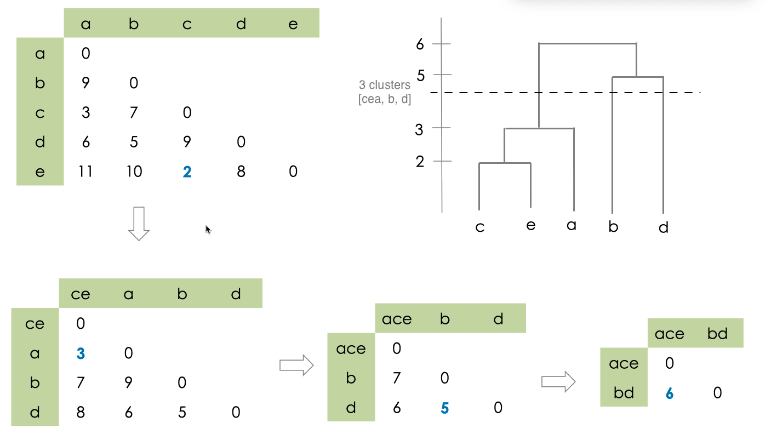

------------------------------------

# Banking Notes:

## How Banks make money?

Banks makes money by following methods:
1.  Investment Banking: Most of the income Barclays make is by being an advisor to big corporations, government and individuals. 
2.  Corporate Banking: It provides services for multinationals and large domestic corporates. It charges fee, interests for loans from these companies.
3.  By charging interest from borrowers.
4.  By charging various fees on services like, 
  a.  Account Fees: For different products in bank, it charges fee for maintenance and services.
  b.  ATM fees: This is charged for ATM usage outside limit and when using other bank’s ATM for services.
  c.  Penalty charges: This can be for late credit card payment or missing a loan EMI.
  d.  Commissions: They provide asset management for which brokers ask for commission.
5.  Merchant Service Charges: Barclays help merchants accept payments. For this bank charges fee for services. It also helps merchant by data analysis for this as well it charges other fees for value added services.


Net Interest Margin (NIM):
- (Interest Earned) - (Interest Paid).
- % = NIM / (Avg earning asset), where
- AEA = Average earning assets = (Assets at the beginning of the year + Assets at the end of the year) / 2.
- The difference between the interest income generated by banks  and the amount of interest paid out to their lenders (for example, deposits), relative to the amount of their (interest-earning) assets.

Retail banking (Consumer Banking):
- Individual consumers can manage their money, take credit, and deposit their money
- Services include checking and savings accounts, mortgages, personal loans, credit cards, FD/RD.

----------------------------------


# Focused Session on Big Data Analytics

Find a polar bear in images from cameras in forest.
- use azure iot to get images from camera
- `devices.json` has camera lat, long, key and id.
- create cloud-shell, this gives bash shell on azure.
- create a resource group (project) on azure., 'streaminglab-rg'
- create storage account 'mysamg1'
- create storage account keys to allow camera to store files to your account.
- create disk space(container) named photos(dir)
- create 'azure iot hub'AIH to recieve photos in realtime. AIH can listen to multiple IOT devices at the same time. 'myhubmg1'
- get connection string to the hub, to access the cameras.
- deploy 10 camera array to AIH, they will send camera snap in some interval.
- On laptop, use node.js for sending photos (simulated cam, else cam kernel will talk to AIH)
- npm install AIH
- create devices.json has {lat: "", long: "", key: "", device_id: "").
- create deploy.json
- node deploy.js, read devices.json, the register to AIH
- key is populated for each devices once it is registered on AIH.
- to store photos, you need `azure-storage` pkg, install using node.
- create `test.js` to upload an image to AIH with camera device id, lat, long, timestamp details.
- Create 'stream analytics job'SAJ under IOT, 'polar_bear_analytics', this will take input from AIH and send the image to 'Vision Analytics'
- stream, clean, not all photo to ml
- In SAJ we can query based on window, timestamps, camera or other dimentions of data.
- SAJ -> Computer Vision APi (CVA), for this use cloud-functions
- go to function app, make func, (streaminglab-rg)
- create 'http trigger func' 
- now cretae 'run.js' that simulates real time, it uploads in random time interval.
- start SAJ
- SAJ sends filtered data to clout function which at the moment logs to console.

Custom Vision 
- Create resource 'polar bear r1'
- kind: CognitiveServices
- the upload training images with tags.
- do quick training of the model.
- now publish this model to get a web-api. 
- we can use this web-api in our cloud ml function, then save the perdiction result to sql server.
- create sql server, myservermg1,
- configure the server to allow zure services, create db and table.
- update the function with js code to read preds from web-api and store results in db.

For counting, use regression model.

# ML Classes:

ML in practise:
- most of the time goes in ML model building
- Auto ML does not works always
- data -> model -> predict
- Learning - 
- p-value tell if the model is correct. it is confidence
- missing values and outliers k liye seek domain guy/customer
- touch more on inference side.
- number has no value, inference has value in corp.

K-means algorithm, hands on:
1. decide number of cluster, k=2
2. initialize random data points as c1(x1, y1), c2(x2, y2).
3. now find eucladian distance (ED) between between all the points and all the centroids.
4. ED = [x1-x2)^2 + (y1-y2)^2]^0.5
5. now the point belongs to centroid to which they have minimum distance.
6. now calculate new c1, c2 by finding average of all new points belonging to the cluster.
7. repeat step 3 to 6, until you get same c1,c2 as in last iteration.

K-Means Variations:
- logic and flow remains same, but we can change the way we calculate the distance, hamming, manhattan etc. This changes the centroid and the point belonging to it.

Business Scenario 💼 :
- Client may say that no, point A belongs to other cluster
- Change clustering method/k value/etc
- so no clustering is best, it can only be acceptable, by client.

Hierarchical Clustering:
- Find dist of each point with everyother point. 5C2.
- create a 5X5 matrix with values as distance bw points
- in dendogram, y-axis is ED between points and x-axis is points.
- This is agglomerative clustering.
- Now any cut on Y axis gives us the clusters.


Uber Case Study:
- Kmeans clustering to find centroid as place from where all rides can be catered. 

# Knowledge Graphs

Patters:
- How different subjects are related, find the connections, eg, Trump Boeing, Binny Bansal and Infosys.
- if business prob requires connections then build graphs
- Subject is node, edge is relationship.
- we can analyse customer care text data, and get insights
- 


# Mind Dump

Partnerships:
- change filter label, grp = partner type, and partner name.
- on all pages.
- add same filters on single merch p&L.
- wed morning.


To do:
- [ ] Plotly Dash +1, Eric Kleppen
- [x] Post to github your flutter finished apps. eg: starred repos
- speed up terminal startup time.
- Flutter ORM
- Python Flask REST API GCP Firebase
- Starred Repos
- Tabs app using BloC.
- todo app in flask RESTful completed, decide backend to be sqlite or firebase?
- flutter ui for todo [app](https://github.com/devinsays/laravel-react-bootstrap)
- flask app with data models integrated, and hosted
- flutter [app](https://wptheming.com/2019/11/flutter-todo-app/) with data models integrated, and hosted

Intro to:
- Tensorflow +1
- Digital Marketing

Watch
- Startup stories
- Google Channels - cloud for students
- ML Recipies
- 7 steps of ML
- ML zero to hero

- wordpress -> JAM Stack

on-going:
- Flutter architecture samples - [BloC](https://medium.com/flutterpub/architecting-your-flutter-project-bd04e144a8f1)
- flask restful
- flask todo miguel
- whatsapp analytics
- feedback pwa, qr
- doodh hisab, notification daily
- medi tracker
- firbase ML in Flutter
- Python ETL
- Tableau publish favourites
- Tableau LM tutorial article/git
- Medium articles to be published

Clean up Mac:
- Used GrandPerspective.dmg
- Win 10 image
- ISB Cludera clarify backup folder
- Files in documents
- remove and delete vagrant
- Pictures- backup and delete
- Music in iTunes
- android avds Library/Android
  - .andoird
- code/Video Tutorials
- code/clients and docs - zip them
  - mongo db - up and running
  - elastic - up and running
  - native - completely remove
  - infy online trainigs - review remove

# Do what I want to do
- dont wait for a miracle to happen.
- be consistent to see result
- get out of comfort zone and 
- no short term pleasures
- If you want to shine like a sun, then first burn like a sun

## identify the pattern, start a journal.
- Identified - laptop/mac not in morning
- Start small, one exercise, picking gradually

## How:
- Goal oriented, break, stick, achieve, reward
  - Goal - fit and look good
  - Break - one exercise
  - Stick - just one, but daily
  - Achieve - Doing
  - Reward - in the mirror.


# Digital Marketing Notes

Instagram page earning:
- original images
- regular posting

# Flutter Notes
- Framework to develop mobile/web apps
- Everything is a widget
- uses DART as a programming language
- code gets compiled to java/javascript/swift for native performance.

Quickstart:
- `flutter create --org com.codeo myapp` create a basic app
- `flutter pub get` gets all packages
- `flutter run -d Chrome` runs flutter app on device chrome
- `pod setup` makes ios deploy faster
- `flutter build web/apk` builds app for publishing

Structure:
- assets - hold images/fonts
- lib - all the dart code
  - we can make folders specific for activity
  - models - hold class for data in the app like users.dart, deserialize json
  - pages - hold screens, each .php page or route
  - widgets - component on pages, like progress bar
- all folders are packages, eg, lib package, src package, models package.

Basic Workflow:
- make product class, init constructor, add factory, the get and set functions
- link this to sqflite
  - have a db_provider
  - and an init function
  - crud functions
- or firebase
  - get reference of a collection in instance.
  - from ref get the snapshots and build.

Development:
- `add(a,b) => a + b` creates function inline and returns valuel, can be without name.
- `setState(){}` - rebuilds the app. usually used in onTap(){}.
- wrapping parameters in {} make them named params and we have to specify the name when passing them in call. eg: `emp({String name, Int age})`, when called, `emp(name: 'Jon', age: 34)`.
- `initState() {}` function gets executed in every State ful widget. can be used to call all what we want to initialize, like db fetch etc.
- `<Future>` needs to be handled. Either we can use `.then((data) {...})` or we can add keywords `async...await` to the functions.
- `factory` before a func declaration makes it accessible outside class just like static.
- To preserve state of app, use mixin keep alive.
- await and async are good to wait for a process to finish and the execute the rest.
- [Null-aware Operators in Dart](https://medium.com/@thinkdigitalsoftware/null-aware-operators-in-dart-53ffb8ae80bb)

Navigation:
- We can generate route on the go with Navigator.pop or push.

Function calling:
- When work needs to be done on call, then pass refrence.
- When function builds/returns then call with ()s.
- Here is the difference:
  - onPressed: \_incrementCounter is a reference to an existing function is passed. This only works if the parameters of the callback expected by onPressed and \_incrementCounter are compatible.
  - onPressed: \_incrementCounter() \_incrementCounter() is executed and the returned result is passed to onPressed. This is a common mistake when done unintentionally when actually the intention was to pass a reference to \_incrementCounter instead of calling it.

External Links:
- appicon.co - app icons
- icons8.com - use icons for free
- vecteezy.com - icons
- canva.com - create own design

## Flutter State Management:
Flutter allows to use many kind of state management architectures like Redux, BLoC, MobX and many more. These all are commonly used architecture to layer out UI from Database/WebAPIs.

BLoC - Business Logic Component
- separates UI from Business logic (Database and Network).
- `Sink<data>` - data in - events
- `Stream<data>` - data out - state


- BLoC component converts a stream of incoming events into a stream of outgoing states. 
- Close bloc references in despose() methods.
- It has:
  - Bloc
  - BlocBuilder
  - BlocProvider

- Reactive Programming, whenever there is new data coming from the server. We have to update the UI screen

- **KeyNote:** *never make any network or db call inside the build method and always make sure you dispose or close the open streams.*

- Single Instance - all screens have access to bloc, there is one instance in the app
- Scoped Instance - only widget to which the bloc is exposed has access

- PublishSubject: Starts empty and only emits new elements to subscribers. There is a possibility that one or more items may be lost between the time the Subject is created and the observer subscribes to it because PublishSubject starts emitting elements immediately upon creation.
- BehaviorSubject: It needs an initial value and replays it or the latest element to new subscribers. As BehaviorSubject always emits the latest element, you can’t create one without giving a default initial value. BehaviorSubject is helpful for depicting "values over time". For example, an event stream of birthdays is a Subject, but the stream of a person's age would be a BehaviorSubject.

- We pass the blocProvider to MaterialRoute and then it houses all the variables to be passed. This acts as inheritedWidget.
- [MovieApp - Part 2](https://github.com/SAGARSURI/MyMovies)

The workflow of the Counter App:
- add packages
- create events as enum.
- create state - in this app, state is `int` so we don't create state class.
- create bloc to take events, map it, and return state, 
  - `class CounterBloc extends Bloc<CounterEvent, int> {...}`
  - here override init state
  - and override mapEventsToState
- instantiate bloc in main using `BlocProvider<Bloc>{}`. 
- create Page, get bloc, 
- get bloc, `final CounterBloc counterBloc = BlocProvider.of<CounterBloc>(context);`
- body will be `BlocBuilder<CounterBloc, int>();` to build UI based on state.
- action event, `onPressed: () {counterBloc.add(CounterEvent.increment);}`
- based on [Flutter Counter App tutorial](https://bloclibrary.dev/#/fluttercountertutorial?id=counter-app) by @felangel.


Redux:
- provides routing as well
- works with store reducer concept

ScopedModel
- Updates only model in scope, not the whole widget tree
- Have to notifyListeners() on each state change

Links:
- [Flutter Architecture Samples to build ToDo apps](http://fluttersamples.com/)
- [The Essential Guide to UI Engineering](https://www.youtube.com/playlist?list=PLS2-V7v1NhNQB66bFNIXlQ_83chw0TgK6)

# Regex Notes:

Remove single line comments // from code:
- `\/\/.*$\n` - Finds all single line comments starting with //.
  - `\/\/` - string has //
  - `.*` - then has anything after that
  - `$\n` - then matches next line as well.
- Check and Validate on [Regex101](https://regex101.com/)

# GCP Firebase Notes

Firebase is cloud based, app-backend service that is scalable and it helps in authentication, database, file storage, hosting, crashlytics, messeging, adMob, analytics, campaigns etc. 

It has following components:

- ML Kit
  - Has in build ML models for text analytics, image recongnition etc.
  - Works on device or on cloud
  - Can add Tensor flow functions/models to firebase functions and it will be hosted and serverd.

- Firebase Authentication
  - Google, fb, twitter etc
  - Account based
  - Gives back user information, unique_id, name, photo,
  - manages sessions

- Cloud functions
  - responses to event, like welcome email on sign in
  - triggers on database events
  - modify files uploaded
  - send cloud messaging messages to other users.
  - build API from database
  - All written in JS using node and then deployed using CLI

- Firebase Hosting
  - Static files hosting
  - on SSD, serves SSL, 
  - can host PWA

- Firebase Storage
  - Store files, secure them, reliable.

- Firebase Realtime Database
  - Store and sync data in realtime, even offline
  - It is NoSql database.


## Firestore Notes
- It is NoSQL database storage engine in firebase
- Works online and offline
- Sotores data in collections

Initialization:
- create database
- create table, called collection, users
- create rows, called document, doc_id

Connecting apps:
- iOS:
  - add GoogleService-Info.plist in xCode 
  - add reverseClientId in key CFBundleURLSchemes Runner/info.plist
- android:
  - add google-services.josn and 
  - make sure applicationId is correct in app/build.gradle

Reading data (Flutter):
- Create a reference to instance of a collection, `userRef = Firestore.instance.collection('users')`.
- The above has functions to fetch records as snapshot of data
- It returns future which need to be handled.
- use StreamBuilder
- stream: Firestore.instance.collection('users').snapshots(),
- reference object accepts chain of functions like `where()..orderBy()..limit()` etc. for compound queries.
- `FutureBuilder` - reads data in database
- `StreamBuilder` - provides stream to data, shows new user added.

NoSQL Structuting:
- do not nest collections
- keep data flatten
- copy data but mostly stored in the way it is best to be fetched.

Create/Update/Delete data (Flutter):
- onTap: () => record.reference.updateData({'key': new_value})
- now its all linked from front to back
- all sync and updates offline and online.
- reference has function like `add()..updateData()..delete()`. They all return `<Future>`.

Triggers:
- user firestore triggers to listen and act on the change in a collection.
- It uses node js to write and deploy the functions.
- Triggers can be created by using Trigger functions. Steps:
  - `firebase login` - login to your google account to use CLI.
  - `firebase init fucntions` - create fucntions folder in flutter project.
  - `firebase deploy --only functions` - deploy functions to firebase cloud.

# Mac OS (Linux) Notes

# Google Cloud Platform Notes

- GCP is cloud service from Google just like AWS and Azure. It provides SaaS, PaaS and IaaS.
- GCP Firebase as datastoage engine.
- GCP App Engine is PaaS for deploying web apps on cloud:
  - App Engine also helps us deploy dockers and containers
  - [hands on colab](https://codelabs.developers.google.com/codelabs/cloud-vision-app-engine/index.html).
- GCP Compute Engine provides VMs, which is like IaaS.
- GCP Cloud Machine Learning:
  - Offers pretrained models with biggest library.
  - Cloud Vision API, Video Intelligence
  - Identify ojects, landmarks, celebrities, colors, million other entities
  - NLP API, Translations,  Text2Speech, Seech2Text API
  - Auto ML trains on your data using expertise from already trained neurals
  - Provides interface to train, evaluate and proof onjects on your own data.
  - SaaS with latest TensorFlow, PyTorch and SKLearn on VMs with TPU and GPU support

## GCP Compute Engine
Start a VM, Ubuntu 20gb, machine 'f1-micro', region 'us-central', allow traffic 'http and https'. This is free for lifetime.

Install gcloud on mac:
- Follow [this](https://cloud.google.com/sdk/docs/quickstart-macos) guide.
- Install `gcloud` on workstation machine, mac, `wget > tar -xf > install.sh > gcloud init`
- Connect to the VM machine using ssh gcloud command, get it from the SSH dropdown on GCP console near VM.
- Command: `gcloud beta compute ssh --zone "us-central1-a" "vm_name" --project "project_name"` this adds to known hosts.

Configuring WebServer:
- Now that you are connected to host VM via SSH, let's start with:
- Update Ubuntu: `sudo apt update && sudo apt upgrade`
- Check ram and CPU usage `htop` , we see that we do not have swap memory, this helps in low ram system when on high load.

Add swap memory:
- Lets allocate 1GB swap memory: `sudo fallocate -l 1G /swapfile`
- `sudo dd if=/dev/zero of=/swapfile bs=1024 count=1048576`
- Assign the correct permission to swapfile: `sudo chmod 600 /swapfile `
- make the swap: `sudo mkswap /swapfile `
- Turn on the swapfile: `sudo swapon /swapfile`
- edit the fstab file: `sudo nano /etc/fstab`
- add this line to the end of file: `/swapfile swap swap defaults 0 0`
- mount the files: `sudo mount -a`
- Check ram and cpu again to verify swap: `htop`

Install Apache2 webserver, PHP and MySQL database:
- `sudo apt install tasksel`
- `sudo tasksel install lamp-server`
- `sudo apt install php-curl php-gd php-mbstring php-xml php-xmlrpc`
- Get the external IP address: `curl ifconfig.me`

Only if you do not have a domain to point to server and want to use vhost:
- Modify the host file to add virtual hosts: `sudo nano /etc/hosts`
- To map 'example123.com' tp IP address add this line: `35.111.00.111 example123.com`

If you have a domain, 
- edit DNS records and add 'A-record' with the external IP address, for eg:
- host: gcp
- IP: 35.111.00.111
- then, `gcp.yourdomain.com` will open the page from GCP VM machine.
- You may also reserve static external IP address of VM on GCP:
  - From your GCP dashboard find 'Networking > External IP addresses'.
  - Now click the down arrow under the 'Type' column and select 'Static' for the External IP address which is connected to your instance of GCP Compute Engine.
  - By reserving a Static IP Address you will not loose your access to website after server outages or restarts.

Add site to Apache Server:
- `cd /etc/apache2/sites-available/`
- `ls -l`
- Copy configuration file for new domain to be added: `sudo cp 000-default.conf example123.com.conf`
- Let us switch to root user: `sudo su`
- edit: `nano codeolab.gcp.conf ` and add following content to file:
```Bash
<Directory /var/www/html/example123.com>
  Require all granted
</Directory>
<VirtualHost *:80>
  ServerName example123.com
  ServerAlias www.example123.com
  ServerAdmin webmaster@localhost
  DocumentRoot /var/www/html/codeolab.gcp

  ErrorLog ${APACHE_LOG_DIR}/error.log
  CustomLog ${APACHE_LOG_DIR}/access.log combined
</VirtualHost>
```
- disable default site: `a2dissite 000-default.conf `
- enable new site: `a2ensite example123.com.conf `
- restart apache service: `systemctl reload apache2`
- go to web documents location: `cd /var/www/html`
- create directory for new site: `mkdir example123.com`
- `cd codeolab.gcp/`
- `nano index.html`
- Now open browser and goto 'example123.com' you should see the contents of index.html.

Configure MySQL Database:
- `mysql -u root`
```sql
> CREATE DATABASE db123;  
> GRANT ALL ON db123.* TO 'db123_user' IDENTIFIED BY 'db123_pwd!';  
> quit;  
```
- Secure the installation `mysql_secure_installation `, select Y for all or as per your need.

Configure PHP:
- `nano /etc/php/7.2/apache2/php.ini `
- update:
```ini
upload\_max\_filesize = 20M  
post\_max\_size = 21M
```

Install Wordpress:
- `cd /var/www/html/example123.com/`
- download wordpress: `wget https://wordpress.org/latest.tar.gz`
- `tar -xvf latest.tar.gz `
- `mv wp-config-sample.php wp-config.php`
- `nano wp-config.php `

Configure MPM_Prefork.conf to manage apache load performance:
- `nano /etc/apache2/mods-enabled/mpm_prefork.conf `
- Update to below:
```Bash
<IfModule mpm_prefork_module>
  StartServers    1
  MinSpareServers   2
  MaxSpareServers   5
  MaxRequestWorkers 10
  MaxConnectionsPerChild  1000
</IfModule>
```

Tune the new Apache install:
- `cd ~`
- `wget https://raw.githubusercontent.com/richardforth/apache2buddy/master/apache2buddy.pl`
- `chmod +x apache2buddy.pl `
- `./apache2buddy.pl `
- This perl script tells the health of Apache server.

User guides:
- video used: https://youtu.be/vIJdypOqlL4

### Adding multiple domains:
- create conf file `cd /etc/apache2/sites-available/` then `sudo cp 000-default.conf addonDomain.com.conf`
- open conf file using nano, then edit
```Bash
<Directory /var/www/html/addonDomain.com>
  Require all granted  
</Directory>
<VirtualHost *:80>
  ServerName example.com
  ServerAlias www.example.com
  ServerAdmin admin@example.com
  DocumentRoot /var/www/example.com/html
</VirtualHost>
```
- make folders `mkdir var/www/html/addonDomain.com/`
- enable site:
```Bash
$ a2ensite example.com.conf
$ systemctl reload apache2
```
- More details [here](https://www.hiyansoft.com/blog/cloud/google/hosting-multiple-websites-on-single-google-cloud-compute-engine/index.html).

### Serve Python files over web
- Apache virtualhost is only for domain/sub-domain, to add more apps with different directories, add directory tags to configuration file. If the two Flask apps are running on the same domain just as subfolders, then you only need one VirtualHost but you’ll need multiple WSGIScriptAlias directives.
- Python is language, Apache2 is webServer, CGI and WSGI are protocol to help web server and language talk to each other.
- Web Server Gateway Interface or WSGI is a simple calling convention for web servers to forward requests to web applications.
- mod_wsgi is an Apache HTTP Server module that provides a WSGI compliant interface for hosting Python based web applications. It is an alternative to CGI.

CGI Scripts:
- Common Gateway Interface or CGI provides interface for web server to serve HTML from console programs like Python.
- By CGI we can directly open `index.py` in browser and it works like PHP file. It outputs the result of the script file.
- default directory is `/usr/lib/cgi-bin/`, you can add, `hello.cgi` here and open in browser.
- enable in apache: `a2dismod mpm_event`
- enable cgi module: `a2enmod mpm_prefork cgi`
- to make new dir for cgi files, add following to site conf file:
```bash
<VirtualHost *:80>
  ...
  <Directory /var/www/html/cgi_dir>
    Options +ExecCGI
    AddHandler cgi-script .py .cgi
    # DirectoryIndex index.py
  </Directory>
  ...
</VirtualHost>
```
- CGI runs script when requested, where as WSGI runs script with start of WebServer.

WSGI:
- Along with flask app, create a `flaskApp.wsgi` file and add:
```python
import sys
sys.path.insert(0, '/var/www/html/flaskapp')
from flaskapp import app as application
```
- Add following to site conf, add following after `var/www/html`,
```bash
WSGIDaemonProcess flaskapp threads=5
WSGIScriptAlias /var/www/html/flaskapp/flaskapp.wsgi
<Directory flaskapp>
    WSGIProcessGroup flaskapp
    WSGIApplicationGroup %{GLOBAL}
    Order deny,allow
    Allow from all
</Directory>
<VirtualHost *>
    ServerName example.com

    WSGIDaemonProcess yourapplication user=user1 group=group1 threads=5
    WSGIScriptAlias / /var/www/yourapplication/yourapplication.wsgi

    <Directory /var/www/yourapplication>
        WSGIProcessGroup yourapplication
        WSGIApplicationGroup %{GLOBAL}
        Order deny,allow
        Allow from all
    </Directory>
</VirtualHost>
```


## Hands on WSGI and Apache2

Assuming you have a working apache2 server and you have python installed. Next we need to install pip and WSGI module.

Python 3:
- `sudo apt-get install libapache2-mod-wsgi-py3`
- `sudo apt-get install python3-pip`

Python 2:
- `sudo apt-get install libapache2-mod-wsgi`
- `sudo apt-get install python-pip`

Enable WSGI and install flask:
- `a2enmod wsgi ` enable the WSGI module in apache.
- `pip3 install flask`

Set up directory and flask files:
- `mkdir /var/www/apps` this contains all flask apps.
- `mkdir /var/www/apps/blog` this is our first app.
- `mkdir /var/www/apps/blog/lib` this contains code for our blog app.
- `mkdir /var/www/apps/blog/lib/static` this will serve static files for our blog app.

Make flask app:
- `sudo nano /var/www/apps/blog/lib/main.py`
```bash
from flask import Flask
app = Flask(__name__)

@app.route('/')
def hello_world():
  return 'Hello from Flask blog app!'

if __name__ == '__main__':
  app.run()
```

Make this folder as python module, (important):
- `touch /var/www/apps/blog/lib/__init__.py`
- We created `__init__.py` as a blank file. This is important and is required to import our lib folder as a python module. Now we can import `lib.main` in wsgi file.

Add the wsgi file:
- `sudo nano /var/www/apps/blog/app.wsgi`
```bash
import sys
sys.path.insert(0, '/var/www/apps/blog')

from lib.main import app as application
```

Configuring virtual hosts conf file to make it work:
- **Imp**, replace 'myapps.com' with your domain name.
- `cd /etc/apache2/sites-available/`
- add a site file `cp 000-default.conf myapps.com.conf`
- `nano myapps.com.conf`
```bash
<VirtualHost *:80>
  ServerName myapps.com
  ServerAdmin webmaster@localhost

  # App: blog, URL: http://myapps.com/myblog
  WSGIScriptAlias /myblog /var/www/apps/blog/app.wsgi
  <Directory /var/www/apps/blog>
    Order deny,allow
    Allow from all
  </Directory>
  Alias /myblog/static /var/www/apps/blog/lib/static

  # logs configuration
  ErrorLog ${APACHE_LOG_DIR}/error.log
  CustomLog ${APACHE_LOG_DIR}/access.log combined

</VirtualHost>
```

- `a2ensite myapps.com.conf`
- `service apache2 restart`

- Now visit `http://myapps.com/myblog/` to access app.

To Do:
- WSGIDaemonProcess helloworldapp user=www-data group=www-data threads=5
- WSGIProcessGroup


Links:
- [Muiltiple flask apps usgin Apache2 and Ubuntu](https://stackoverflow.com/questions/29882579/run-multiple-independent-flask-apps-in-ubuntu).

## Access VM flask app on localhost from host machine:
- Run flask app with `app.run(host='0.0.0.0', debug=True)`
- then access `192.168.10.33:5000` from host machine.
- 

# Vagrant Notes
It is a CLI to create virtual box with all configurations in a file. 
- Install vagrant by downloading from site. It installs package with CLI.
- Create following file in a folder `~/vagrant/vagrantfile`:
```py
Vagrant.configure("2") do |config|
  config.vm.box = "ubuntu/xenial64"
  config.vm.network "private_network", ip: "192.168.33.10"
  config.vm.provider "virtualbox" do |vb|
    vb.memory = "1024"
  end
end
```
- Then run `vagrant up`. This will download and install ubuntu 16.04, 1GB, at 192.168.33.10
- do, `vagrant ssh` to ssh to new vm.
- `vagrant halt` to stop a VM
- `vagrant destroy` to delete a VM


# Python Notes


# AI image generator Notes:
- GAN is used to genrete original like images
- Deep Convolutional Generative Adverserial Networks (or DCGAN) are a deep learning architecture that generate outputs similar to the data in the training set.
- This person does not exist.com
- nVidea research lab, start with low resolution and keep training to make a full resolution image.
- two ai neural network work against each other to generate and eveluate the images.
- fake images, fake media
- computing power is still issue
- lip syncing image to audio
- dataGrid, deepFake AI models

# Agriculture

What went wrong:
- Punjab destroyed
- Debt suside
- Water level

Important people:
- Aacharya Devvrat, Rajyapal, Himachal Pradesh
- Subhash Palekar, noble price winner
- Vandana Shiva, nobel price winner
- Binay Kumar, art of living
- Prem Singh, Ecological farmer, activist

Cow Breeds
- A2 cow is desi and amrit

Where money goes?
- Monsento
- Syngencha
- SBI
- Bill Gates - failed gmo project

## Zero Budget Natural Farming (ZBNF):
- Farming technique in which we do not use raw materials like pesticide, urea etc.
- Belief is that soil needs to be living with microorganisms and worms
- Itegrating cow dung and urine make it living and this everything flourishes.

- Benifits:
  - Long live of plants
  - 90% less water
  - Climate resistant

- Products:
  - Ghan Jivamrit (fertilizer)

- Important people:
  - Aacharya Devvrat, Rajyapal, Himachal Pradesh
  - Subhash Palekar, noble price winner

## Permaculture
- Karne se zada hone do kaam ko
- Sustainability will come
- greed drives life, show money to farmers in prmcltr

- Health
  - Soild needs skin, leves, grss etc.
  - Value organic matter.


# Astrology and Vedic Life
- hormones control body
- planets control hormones
- stones link to planets
- stones filter light and inc/dec effect of planet
- stones also have vibrations
- Law of Vibration, ‘everything in the universe moves or vibrates’.
- birth snap of planets effect you

## Taurus
- Auspicious
  - Saturn is on your side.
  - Mercury helps you communicate effectively.
  - Mars is also a blessing for Taurus. 
  - Sun is ideal for a Taurus to achieve success in life.

- Malefic 
  - Jupiter can harm you if you’re a Taurus. 
  - Venus can make you unhappy and dissatisfied in life.
  - Moon is also malefic for a Taurus and can deter you from destiny. 

## Om Theory
- Om is originator vibration, 
- https://www.one-mind-one-energy.com/theuniversallaws.html
- from om five elemental vibrations emerged.
  – Jupiter for Ether, 
  - Saturn for Air, 
  - Mars for Fire, 
  - Mercury for Earth, and 
  - Venus for Water.
