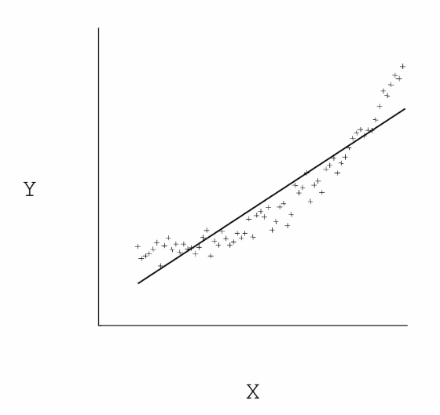

ISB 


------------------------------------


------------------------------------
# History:

Indus valley
- building cities and bath
- exchanged goat and crops
- had a language

Egypt
- around the river NIle
- rich in resources
- advancement in trade and military

Perians and Greeks
- 
------------------------------------


# CT3: Fraud Analytics

Frauds: Fake insurance, wrong medical claims and invalid transactions.

Money Laundering: Hide the origin of money by passing from complex transactions.

Why ML here: It can detect fraud using behaviours in data.

[C5.0](https://cran.r-project.org/web/packages/C50/vignettes/C5.0.html) is a classification algorithm. This was used to create a model which detected Money Laundering. It reduced number of transactions reported from 30% to 1%.

Based on behavioural data ML model can detect **anomalies**. It shows a row of data that stands out, like, too many txns on online shopping.

We use supervised learning, where based on each columns (attributes) we assign a class to the data. Data has to be labbeled.

- **Deep Neural Network (DNN)** can be used for classification. **Neural Networks** has hidden layers where we use transform functions, DNN has 100s of hidden layers.

- **Perceptron** is the simplest neural network possible: a computational model of a single neuron. A perceptron consists of one or more inputs, a processor, and a single output. It defines decision boundary between classes by defining the **hyper planes** in higher dimensions.

- **SVM or Support Vector Machines** can be used for classification. It uses a technique called the kernel trick to transform your data and then based on these transformations it finds an optimal boundary between the possible outputs. It finds several hyperplanes to minimize the classification error.

- **K-Nearest Neighbours or KNN** uses simplicity metrics to group samples into classed in featured space. New data is assigned to the class which is nearest to the class.

- **Random Forests** breaks data in many samples and makes decision tree from each. New data is passed from trees and then picks the majority vote to assign data to class. This outperforms others but has issues of overfitting.

Financials fraud data is generally skewed.

**Exploratory Data Visualization** is used to view how our classes differentiate. Find patterns of differentiation in data.

- **Andrews Plot** shows curves and usually classes are well seperated in the curves.

- **Parallel Lines**

ML

Dimentionality Reduction

Examples Datasets


Machine learning for Fraud Analytics

Fraud Stats:
- $26b fraud
- CNP 82% reason

Examples of Fraud:


Potential for ML use:
- banks legacy systems use about 300 rules to approve a txn
- ML algos can use other attributes of user like IP, device, day of time etc to detect fraud.
- We will use supervised learning.
- *80% time in EDA and DC.*

Anomaly Detection:
- 


------------------------------------

# SA4 - Term 4

## Linear Regression 


It is relation between observations X and their outcomes Y.

It is a line which has closet distance to all possible outcomes from observation.

Why do LR:
- Relation: Understand relation between X and Y, e.g.
  - Relation of sales on profit
- Prediction: To make predictions about Y variable

**Problem:** Anita wants to predict the number of toys she can sell in coming half year.

Step 1: Modeling (define): Develop a regression model
- identify the variables: proce/advertising cost/promotion costs
- Variables are not exhaustive
- SalesUnits = $\beta_0 + \beta_1 Price + \beta_2AdExp + \beta_3PromExp$
- Beta_s are coefficients,
- signs expected are: b1 -ve, b2 +ve, b3 +ve

Step 2: Estimation (fit): Using software to estimate the model
- prior data, collected over time
- use excel/r/python and get refgression output
- this gives coeffiecients, the betas
- get expected signs of betas

Step 3: Inference: Interpreting the estimated regression model
- $SalesUnits = -25096.83 - 5055.27Price + 648.61AdExp + 1802.61PromExp$
- beta means when X increase by **one unit** y increases by beta times, keeping others constant.
- beta0 is Y when all X are 0.
- beta0 is fixed cost of production, without making any unit.

Step 4: Prediction: Making predictions about Y variable
- put value of Xs and betaS and get Y value.
- create 3 scenarios, how much to set price, how much to send on ad and promotions, based on these scenarios we get Y that can help us decide.

Step 5: Evaluate: Determine how accurate the model's predictions are.

Results:
95% time on Modeling, 5% on rest steps.

Assumptions:
- Hypothesis testing on the regressions:
- $Y = \beta_0 + \beta_1X_1 + \epsilon$
- there is error associated, calles epsilon
  - becasue we are missing one of the X
  - X and Y are not perfectly linear.
  - this error is how individaul data point(on regression line) deviate from actual point
  - THis is one of the most imp of 5 assubptions underlying regression.
  - these errors are normally distributed around 0.
  - avg of errors is 0, $\epsilon_i ~ N(0,\sigma)$
  - based on this assumption we can develop a hypothesis test around this regression model 

Based on above:
- $Y ~ N(\beta_0 + \beta_1X_1 + \beta_2X_2 + ... + \beta_kX_k , + \epsilon$)$
- here mean is Betas and Xs, and std dev is epsilon
- [ ] Why

Base on above we will generate Confidence interval
- True Model : $Y = \beta_0 + \beta_1X_1 + \beta_2X_2 + ... + \beta_kX_k $
- Estimated Model : $y = b_0 + b_1x_1 + b_2x_2 + ... + b_kx_k $

- in regression output we do have result of hypothesis test, as p-values
- Now CLT says, the whne we take sample from population them sample mean $\barx$ follows Norm Dist ($\mu, frac(\sigma\\sqrt \sqrt(n))), this is imp
- CLT develops relation b/w sample and popltn mrean.
- This CLT projects sample results to estimate the population params.
- We will never know betas as they are of population.
- $b_0 ~ Norml(\beta_0, std_\beta_0)
- In this way we estimate all betas based on bees
- This is used for hypo thesis testing.
- $\frac(\b_0 - \beta_0)(S_b_-1) ~ t_(n-k-1)$

Example: Toy example
- now if you have coefficient estimate 600 but sales people say i should be around 300, then we have to check.
  - it is estimate ffrom sample, hence estimate and is uncertain, it is a belief, and it can be accepted or rejected. Hence, Hypothesis test.
  
**Method 1:**

Step 1: Formulate  a Hypothesis test.
    - Ho: beta2 = 300
    - Ha: beta2 != 300

Step 2: Calculate t-statistic:
- t is x bar - mu over sigma
- (b2 - beta2) / std_err of b2
- (648-300)/209.004 = 1.667

Step 3: cutoff for t statistic: 
= T.INV(prob/deg of fredm)
= Left T.INV(0.005/2, 1.667) = -2.0859
= Right = 2.0859

Step 4: Make a decision
- Since, t satistics (1.667) does not fall in any reejection region, Outside of(-2.0859,+2.0859), i cnnot reject the nULl hypo.
- My data does not have enough evidence to falisfy the claim.


**Method 2:**

1,2 same

Step 3: Calc p
Calculate p-value =  twice the area of tail cut by t-statistic.
=2\*(1-T.DIST(1.667,20,TRUE)), 1- cz we need right.

Step 4: Reject or not
- When p is low null has  to go.


Why is p-value imp:
- tells significance of X in explaining Y,
- *when p is low, null has to go*


# Session 2

Problem a): Test the Hypothesis that price has no effect on sales

Answer: Check hypothesis on beta1 ehich is coefficient of Price.

$H_0: \beta_1=0$
$H_1: \beta_1 \neq 0$

- Check this using confidence interval from refression output.
- lower 95% = -6153.32 and upper 95% = -3957.22
- hecne, beta1 != 0
- also, p value = 6.2E.09, which is low, null has to go.
- We reject the NULL Hypothesis, Ho, so sales is dependent on price.

Problem b): Company would agree to proposal of 25 cents drop in toy price if there is evidence that price reduction would lead to *at least* an increse of 1500 unit sales.

Answer:
- When price inc by 1 then Sales inc by $\beta_1$ units.
- when price dec by 1 then Sales inc $-\beta_1$ units.
- when price dec by .25 then => Sales inc $-\beta_1/4$ units.

$=> H_0: -\beta_1/4 \geq 1500$ and $H_1: H_0$ not true

$=> H_0: -\beta_1 \geq 6000$ and $H_1: \beta_1 < 6000$

$=> H_0: \beta_1 \leq -6000$ and $H_1: \beta_1 > -6000$

- This single tail test, solve using CI in summary table.

- to do

Problem: Car

Answer: 
- Y variable is gasoline required for 100 miles.
- Y column = 100/MPG
- Run regression, from output,

- Weight - for every 1000 lb increase in weight of car, the gasoline required to travel a 100 miles increases by 1.56 gallons, all other varibales kept at the same level.
- Horsepower 
  - since p-value is more than alpha hence it is not significant in explaining Y. 
  - This seems wrong and is a pitfall of regression, will be covered in multi-co-linearity.
  - this should be checked as, from common sense, horsepower effects mileage.
- R square 
  - the variance explained by residuals is 92%, 
  - there is variation in Y variable because some have high efficiency some low.
  -  It can explain 92% of this variablility in fuel efficiency, 
  - how much variation gets explained is R-square. 
  - 92% is high, hence, model will make good predictions.
- What impacts fuel efficiency the most?
  - we cannot depend on coefficient as it is unit dependent.
  - p-value are used as cut-offs to rule out the coefficient.
  - 1sd change in weight, has coeff sd change in Y, 1sd change in weight is 1.01 sd change in Y. hence weight has more impact.


# Session 3:

- When understanding marginal (individual) effects, then multicolienarity is considered, might be a prob. DO a pair wise col- relation, when high the worry,  like more than 90. To solve, just drop one var.
- when predicting, then multicolienarity is, the ignore muli co. it is not a prob.


## Models with Categorical Independent variables

What are categorical vars:
- eg: Gender, values are simply labels.
- eg, Color of car, [red, black, blue, silver]
- we cannot do mathematical operations.
- eg, Quarter of year [1,2,3,4], numerical by cannot do operrations, like 4th quarter is 2 times 2nd quarter. They are simply labels.

How can they be helpful in reg analysis
- Take auto dealership example:
- does color effect sales? yes
- now software cannot take colors.
- specific technique to incorporate catagorical var in regression model, use **Dummy Variables**
- Rules for dummy varibales:
  - can take only 0 or 1
  - number fo dummy varibales required is one less than the number of caehories in the caregorical vaariables.
  - we need, 1 dv for gender. 3 for quarters, 3 for color
  - inference is always in reference to each oher, eg, male earn more than female, regionA is far than regionB.

Problem: Delivery Service, relation b/w deliver time and number of paecels in region A and region B

Soltion:
- data tells, truck moves from warehosue (ISB) goes to region A and makes 30 deliveris and takes 304 minutes.
- Y var is minutes, dependent var
- Region is categoriccal, can take one dummy var, 'Dummy', 1 when A, 0 when B, as A is 1, hence name can be, RegionA, this makes helpful to see what column has.
- $Minutes = \beta_0 + \beta_1RegionA + \beta_2Parcels$
- These two vars, RegionA and parcels, can explain 96.6% of variablility in delivery time.
- Remaining 3.4% that goes unexlained. May be more vars can explain that, like traffic, truck age etc.
- b2, for each new package, 8.71 minutes more is taken, irrespective of region delivered. SInce, p-value is low hence his is significant. 
- b1, deliveris made to regionA takes 111.58 minutes less as compared to deliveries to regionB.
- b0, intercept, 142.06, this is time to deliver 0 parcels to region b, regionB because it is 0 and 0 parcels as deliveries are 0. this is tiem to travel from ISB to region B, once at region B, then it will take, b2, 8.71 more time to deliver each additional packages.
- b0 and b1, time taken to reach regionA, = 142.06 - 111.58 = 30.486, if we take dummy variable as regionB (1 for b and 0 for a) then we would get intercept, b0 as 30.486 and b1, as +111.58. They are all relative to data. 

How would you test the null hypothesis that the “fixed time” to travel to both regions is the same, against the alternative that it is different using this output at a 5% significance level? .
- $Minutes = \beta_0 + \beta_1RegionA + \beta_2Parcels$
- Fixed time for regionA is time in mking 0 deliveries.
- $Minutes = \beta_0 + \beta_1X1 + 0 = \beta_0 + \beta_1$
- for regionb,  $Minutes = \beta_0 + \beta_1X0 + 0 = \beta_0$
- reject, Ho: Bo = 0 | Ha: Bo != 0
- by p vale we reject null hyp, 
> please follow vdo.

Problem: We ahve region C as well.

- we need 2 dummy variables. regA, regB, or any combination of these. we take RegB and RegC.
- `RegB=IF(B2="B",1,0)` where B2 is region. same for C.
- RegionA will always be 0, it becomes reference var, interpretation of B and C will be w.r.t region A, it is our choice and can be changed.

- $Minutes = \beta_0 + \beta_1RegionB + \beta_2RegionC + \beta_3Parcels$
- more in spreadsheet, deliveris2.xlsx.

- p-value is hight, then, it means the two dummy values are kind of same. Foe eg, if we have Q1 Q2 Q3 and Q4, then if beta for q2 is 3.5 with p-value .267 does not mean q2 sales is 3.5million$ more than Q4, it means Q2 is similar to Q4.

- Get the data
- define x and y variables, based on problem
- make categorical x variables as dummy variables.
- run the regression.
- analyse the output
- hyp
- do prediction, 
- get conf interval for prediciton.


# Session 4

- To extend lin reg to more than 3 dummy variable we have to follow the same process. make n-1 dummy var columns with 0 and 1.

## Handling Npn-Linearity

- 95% time should be spent on understanding data.
- how variables are related. Are they linear or have a curve?
- Lin Reg will try to find a best fit line but actually the relation might be curved.
- rather than new non-linear technique, we can transform the data.



### How to find non-linearity

- make scatter plots between Y and all Xs. Plot the Y - dependent variable against each of the Xs - explainatory variables and visually see for non linearity if any.
- take transformations, like log(X3) or log(Y) and see if R^2 is improved.

Common transformations:
- log
- exp
- sq, sr root, cubes
- inverse

These transformations need to be non-linear, it can't be 6x +5.

$$
lm(a) = B

a = expt(b)
ln(a x b) = ln a + ln b
ln a/b = ln a -ln b
ln 1 =0
ln -1 - not defined
ln 0 = not defined
$$

if our data has 0 or -ve values the we cannot take log transformations.

### Log-Log Model (or Elasticity Model)

$ ln(y) = \beta_0 + \beta_1ln(x_1) + \beta_2ln(x_2) + ... +  $

**Interpretation**: 1% inc in x1 increases y by beta1% and so on...

e.g. $ ln(sales) = \beta_0 + \beta_1ln(price) + \beta_2ln(AdExp) + \beta_2ln(Promotions) $

say, b2 = 0.04, p-val=0.00001

so, 1% inc in AdExp increases Sales by 0.04%. That's how log-log model should be interpreted.

Economists love this kind of interpretation, called *elasticity*.

### Semi-log model (growth rate model)

$ ln(y) = \beta_0 + \beta_1x_1 + \beta_2x_2 + ... +  $

**Interpretation**: 1 unit inc in $x_1$ increases y by $(\beta_1\times100) \% $ , and so on...


Problem: Coffee Production from 1946-91

more in coffee.xlsx

if it is mixed, log and non-log then the interpretation changes. if both x and y are log then log log, if ln(y) and x, then semi-log.


## Session 5: Logit Models


8:40 onwards -->

Slide 6:

B1 - For 1 unit inc in X1, the odds ratio gets multiplied by e^B1, all other variables kept at them same level, i.e., odds increase by (e^B1 - 1)X100%


# SA4 Tutorial

- Logistic regression used when y(0,1)
- it predicts probability of Y being 1, usually success
  - labour force participaiton of women
  - medicine is effective to cure or not
- Why no linear regression for binary responses?
  - usually inadequate [ ]
  - predicts b/w -infinyt to = infinity, weneed b/w 0,1
  
logit is function, hence logistic 

- it can take val b/w 0,1 and map it to val b/w -ini to + inf

- todo: add equations

Problem: Donner Party
- women are more capable of surviving harsh conditions compared to male
- do EDA
- Fit the model and interpret it.
- Test the Goodness of Fit.
- Accuracy from Confusion Matrix.
- Specificty of the model
- ROC Curve - more the area under the curve, better it is.
- H2O - GLI, good guide
- uc-r.github.io/iml-pkg - can be used with R


## generalized linear model 
Not required:
- No lin rel b/w dependent nd independednt vars
- normality of err not required
- homoskedasticity not  reqquied

Needed
- vars is binaty
- model specifictin
- no collinearity
- independence
- linearity - log odds and independednt vars
- large samole size
  - 10 obs per independent variable

- Do residual plots

- model selection, 
  - fwd selection
  - bkwd selection
  - stepwise
  - Bases on AIC, BIC, Pseduo R-sqrd

Lasso for var selection
Ridge is a way to make better model.


------------------------------------

# Focused Session on Big Data Analytics

Find a polar bear in images from cameras in forest.
- use azure iot to get images from camera
- `devices.json` has camera lat, long, key and id.
- create cloud-shell, this gives bash shell on azure.
- create a resource group (project) on azure., 'streaminglab-rg'
- create storage account 'mysamg1'
- create storage account keys to allow camera to store files to your account.
- create disk space(container) named photos(dir)
- create 'azure iot hub'AIH to recieve photos in realtime. AIH can listen to multiple IOT devices at the same time. 'myhubmg1'
- get connection string to the hub, to access the cameras.
- deploy 10 camera array to AIH, they will send camera snap in some interval.
- On laptop, use node.js for sending photos (simulated cam, else cam kernel will talk to AIH)
- npm install AIH
- create devices.json has {lat: "", long: "", key: "", device_id: "").
- create deploy.json
- node deploy.js, read devices.json, the register to AIH
- key is populated for each devices once it is registered on AIH.
- to store photos, you need `azure-storage` pkg, install using node.
- create `test.js` to upload an image to AIH with camera device id, lat, long, timestamp details.
- Create 'stream analytics job'SAJ under IOT, 'polar_bear_analytics', this will take input from AIH and send the image to 'Vision Analytics'
- stream, clean, not all photo to ml
- In SAJ we can query based on window, timestamps, camera or other dimentions of data.
- SAJ -> Computer Vision APi (CVA), for this use cloud-functions
- go to function app, make func, (streaminglab-rg)
- create 'http trigger func' 
- now cretae 'run.js' that simulates real time, it uploads in random time interval.
- start SAJ
- SAJ sends filtered data to clout function which at the moment logs to console.

## Custom Vision 
- Create resource 'polar bear r1'
- kind: CognitiveServices
- the upload training images with tags.
- do quick training of the model.
- now publish this model to get a web-api. 
- we can use this web-api in our cloud ml function, then save the perdiction result to sql server.
- create sql server, myservermg1,
- configure the server to allow zure services, create db and table.
- update the function with js code to read preds from web-api and store results in db.

For counting, use regression model.

------------------------------------

# ML Classes:

ML in practise:
- most of the time goes in ML model building
- Auto ML does not works always
- data -> model -> predict
- Learning - 
- p-value tell if the model is correct. it is confidence
- missing values and outliers k liye seek domain guy/customer
- touch more on inference side.
- number has no value, inference has value in corp.

K-means algorithm, hands on:
1. decide number of cluster, k=2
2. initialize random data points as c1(x1, y1), c2(x2, y2).
3. now find eucladian distance (ED) between between all the points and all the centroids.
4. ED = [x1-x2)^2 + (y1-y2)^2]^0.5
5. now the point belongs to centroid to which they have minimum distance.
6. now calculate new c1, c2 by finding average of all new points belonging to the cluster.
7. repeat step 3 to 6, until you get same c1,c2 as in last iteration.

K-Means Variations:
- logic and flow remains same, but we can change the way we calculate the distance, hamming, manhattan etc. This changes the centroid and the point belonging to it.

Business Scenario 💼 :
- Client may say that no, point A belongs to other cluster
- Change clustering method/k value/etc
- so no clustering is best, it can only be acceptable, by client.

Hierarchical Clustering:
- Find dist of each point with everyother point. 5C2.
- create a 5X5 matrix with values as distance bw points
- in dendogram, y-axis is ED between points and x-axis is points.
- This is agglomerative clustering.
- Now any cut on Y axis gives us the clusters.


Uber Case Study:
- Kmeans clustering to find centroid as place from where all rides can be catered. 

## Knowledge Graphs

Patters:
- How different subjects are related, find the connections, eg, Trump Boeing, Binny Bansal and Infosys.
- if business prob requires connections then build graphs
- Subject is node, edge is relationship.
- we can analyse customer care text data, and get insights
- 

-------------------------------------------

only ISB above ^

-------------------------------------------


# Mind Dump

-------------------------------------------


-------------------------------------------

# Blogging and Notes Decisions:


## Bookdown:

Quick [getting started](http://seankross.com/2016/11/17/How-to-Start-a-Bookdown-Book.html).

Steps:
- `mkdir bookdown`
- `cd bookdown/`
- `git clone https://github.com/seankross/bookdown-start`
- `cd bookdown-start/`
- `r`
- `bookdown::render_book("index.Rmd")`

- all `# heading 1` are chapters.
- Add `Part I` before a chapter to make it part in a book, `# (PART) Data Science {-}`
- `> options(bookdown.render.file_scope = FALSE);` to use parts in diff directories.

References:
- https://bookdown.org/mpfoley1973/data-sci/
- https://bookdown.org/yihui/rmarkdown-cookbook/rmarkdown-anatomy.html
- https://bookdown.org/yihui/bookdown/html.html
- https://rafalab.github.io/dsbook/introduction-to-productivity-tools.html
- Rafalab book [source github](https://github.com/rafalab/dsbook/blob/master/_bookdown.yml).
- Python Visualizations in [bookdown](https://bookdown.org/jamie/python_visualisation/)
- Using [Python Environments](https://bookdown.org/yihui/rmarkdown/language-engines.html)
- Show plotly html js in Rmarkdown [stackoverflow](https://stackoverflow.com/questions/50191208/display-python-plotly-graph-in-rmarkdown-html-document)
- code options [cheat sheet](https://rstudio.com/wp-content/uploads/2015/02/rmarkdown-cheatsheet.pdf)
- publishing on [github](https://bookdown.org/yihui/bookdown/github.html)


-------------------------------------------


------------------------------------------------

------------------------------------------------

# Digital Marketing Notes

Instagram page earning:
- original images
- regular posting


------------------------------------------------

# Plotly D3 Vizs

- poltly built on top of D3
- python api uses plotly.js


Plotly Library:
- data - result of go.chartType(x=, y=, others=....)
- layout - title, axis, annotations
  - has param `updatemenus`
  - There are four possible update methods:
    - "restyle": modify data or data attributes
    - "relayout": modify layout attributes
    - "update": modify data and layout attributes
    - "animate": start or pause an animation
- frames: used for animations
  - we can add different frames to a chart
  - this can be used to produce the animations
  - Example can be found [here](https://plotly.com/python/animations/#frames).
- figure - final object combining data and layout.

Dash is putting and linking many plotly charts together.

## Other plotly products

Dash:
- Dash is Python framework for building *analytical web applications*.
- It is built on Flask, Plotly.js and React.js
- Just like flask, we define `app = dash.Dash()` and then at end `app.run_server()`
- We can create complete site with links.
- It has intractable story.

Chart Studio 
- is like Tableau web edit and public.
- Can create and host data, charts and dashboards.
- can explore other people's work.
- charts are interactable and linked together.
- can be reverse engineered.
- can host notebooks as well.

ObservableHQ:
- Live, web edit, d3 notebooks.
- markdown and JS blocks
- lots of d3 features. like counts, action buttons etc
- can make dasboard as well.


References:
- [How and why I used Plotly (instead of D3)](https://www.freecodecamp.org/news/how-and-why-i-used-plotly-instead-of-d3-to-visualize-my-lollapalooza-data-d48345e2ca68/)
- [4 interactive Sankey diagrams made in Python](https://medium.com/plotly/4-interactive-sankey-diagram-made-in-python-3057b9ee8616)

------------------------------------------------


# Flutter Notes
------------------------------------------------


------------------------------------------------

# GCP Firebase Notes

------------------------------------------------

# Mac OS (Linux) Notes

------------------------------------------------

# Google Cloud Platform Notes


------------------------------------------------

# Flask Notes


------------------------------------------------

# Web Server Notes


------------------------------------------------


# Python Notes

## Anaconda and Conda Notes with Jupyter and R Studio

**Anaconda** is toolkit for Data Science.
- it includes ds and ml libraries along with conda, and 
- other tools like jupyter, rstudio etc.

**Conda** is package manager and environment manager, like pip,
- it can install packages and 
- can manage envs 
- It is a CLI

**Anaconda Navigator** is GUI to use conda.

Conda Basic Commands:
- `conda config --set auto_activate_base false` disables autoload base
- `conda update conda` updates conda
- `conda install PACKAGENAME ` installs pkg to default/active env
- `conda update PACKAGENAME ` updated pkg
- `pip install pkg` aslo intalls to active env

Conda Env Commands:
- `conda create --name py35 python=3.5` created new env and installs py 3.5
- `conda activate py35` activates
- `conda list` lists all akgs installed ina ctive env.

**Jupyter** name comes from Julia, Python and R,
- formerly known as *IPython Notebook*
- it is pkg, same as flask
- `pip install jupyter` or it comes installed in Anaconda dist.
- `jupyter notebook` runs a server to server jupyter notebooks at http://localhost:8888/tree

**R and RStudio** are statistical language and IDE,
- `r` or `R` - R console in terminal
- `Rscript my.r` - executes file in terminal
- `Rscript -e "getwd()"` - executes cmd in terminal, can quickly install a library.
- `R CMD BATCH my.r` runs R script and saves output to `my.r.Rout`
- To make R Script executable like `./my.r` then:
  - set permission to 755
  - add correct `#!` to top of file

```r
#!/usr/bin/env Rscript
sayHello <- function(){
   print('hello')
}

sayHello()
```


## Regex Notes:

Remove single line comments // from code:
- `\/\/.*$\n` - Finds all single line comments starting with //.
  - `\/\/` - string has //
  - `.*` - then has anything after that
  - `$\n` - then matches next line as well.
- Check and Validate on [Regex101](https://regex101.com/)
------------------------------------------------

# AI image generator Notes:
- GAN is used to genrete original like images
- Deep Convolutional Generative Adverserial Networks (or DCGAN) are a deep learning architecture that generate outputs similar to the data in the training set.
- This person does not exist.com
- nVidea research lab, start with low resolution and keep training to make a full resolution image.
- two ai neural network work against each other to generate and eveluate the images.
- fake images, fake media
- computing power is still issue
- lip syncing image to audio
- dataGrid, deepFake AI models


------------------------------------------------


# Agriculture

What went wrong:
- Punjab destroyed
- Debt suside
- Water level

Important people:
- Aacharya Devvrat, Rajyapal, Himachal Pradesh
- Subhash Palekar, noble price winner
- Vandana Shiva, nobel price winner
- Binay Kumar, art of living
- Prem Singh, Ecological farmer, activist

Cow Breeds
- A2 cow is desi and amrit

Where money goes?
- Monsento
- Syngencha
- SBI
- Bill Gates - failed gmo project

## Zero Budget Natural Farming (ZBNF):
- Farming technique in which we do not use raw materials like pesticide, urea etc.
- Belief is that soil needs to be living with microorganisms and worms
- Itegrating cow dung and urine make it living and this everything flourishes.

- Benifits:
  - Long live of plants
  - 90% less water
  - Climate resistant

- Products:
  - Ghan Jivamrit (fertilizer)

- Important people:
  - Aacharya Devvrat, Rajyapal, Himachal Pradesh
  - Subhash Palekar, noble price winner

## Permaculture
- Karne se zada hone do kaam ko
- Sustainability will come
- greed drives life, show money to farmers in prmcltr

- Health
  - Soild needs skin, leves, grss etc.
  - Value organic matter.


------------------------------------------------


# Astrology and Vedic Life
- hormones control body
- planets control hormones
- stones link to planets
- stones filter light and inc/dec effect of planet
- stones also have vibrations
- Law of Vibration, ‘everything in the universe moves or vibrates’.
- birth snap of planets effect you

## Taurus
- Auspicious
  - Saturn is on your side.
  - Mercury helps you communicate effectively.
  - Mars is also a blessing for Taurus. 
  - Sun is ideal for a Taurus to achieve success in life.

- Malefic 
  - Jupiter can harm you if you’re a Taurus. 
  - Venus can make you unhappy and dissatisfied in life.
  - Moon is also malefic for a Taurus and can deter you from destiny. 

## Om Theory
- Om is originator vibration, 
- https://www.one-mind-one-energy.com/theuniversallaws.html
- from om five elemental vibrations emerged.
  – Jupiter for Ether, 
  - Saturn for Air, 
  - Mars for Fire, 
  - Mercury for Earth, and 
  - Venus for Water.
